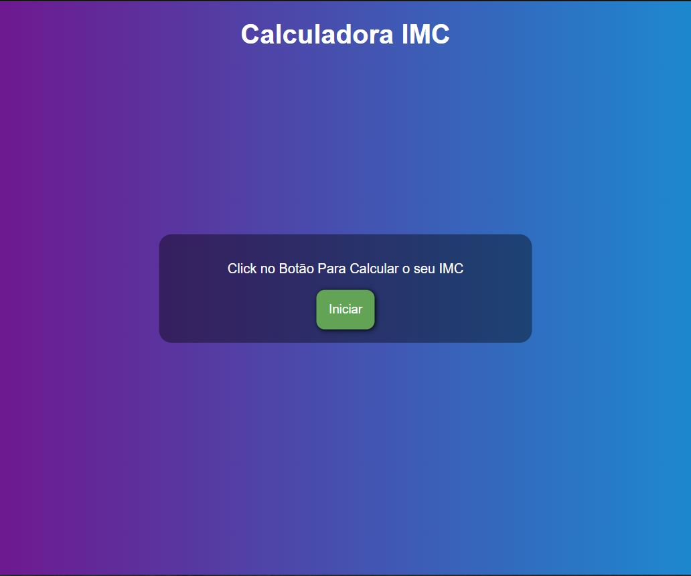
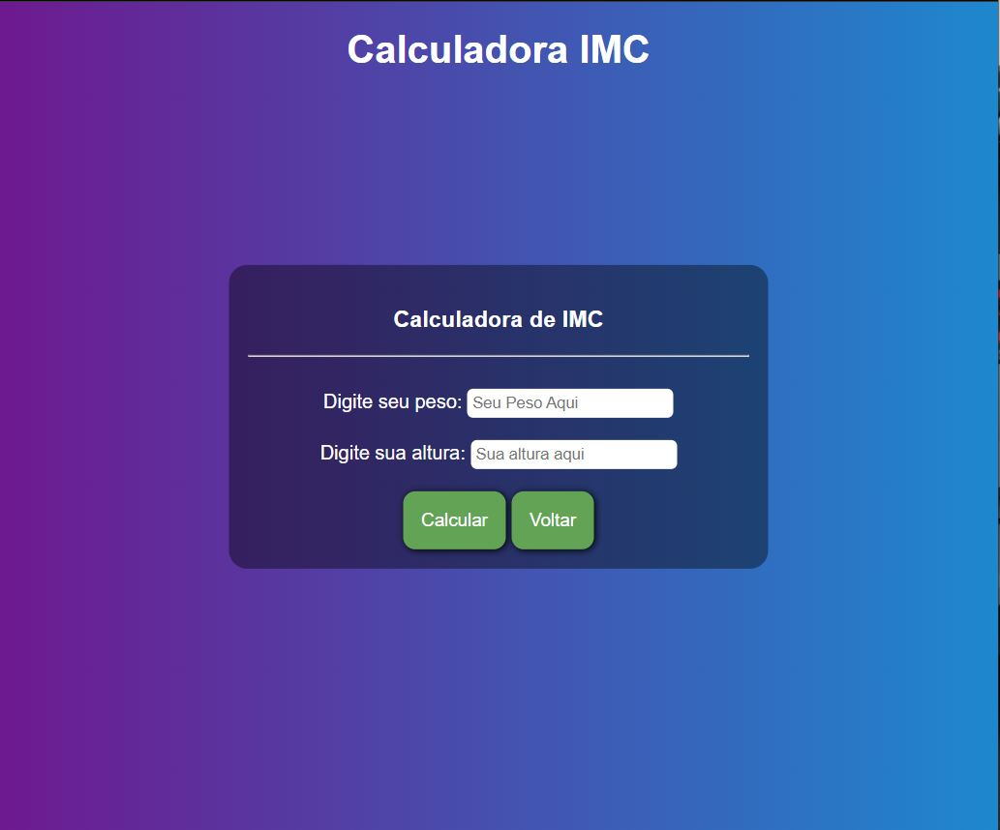
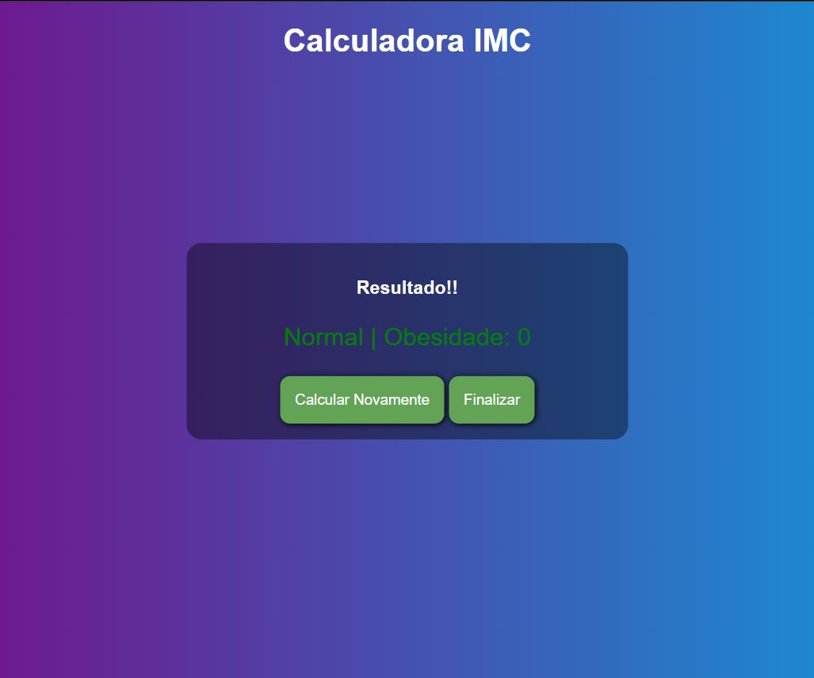

 
    <h1>BMI - Calculator  </h1>
  <h3> Program to Calculate the Body Mass Index </h3>

Desenvolvido um widget completo e acessível, que pode ser utilizado em vários projetos para, coletar feedbacks e relatórios dos usuários, todo o backend e frontend da aplicação foi feito em ReactJS/ Vite/ TypeScript. e o aplicativo em sua versão mobile Desenvolvido com React Native

-    <a href="#Demonstração do Projeto">Demonstração do Projeto</a> * 
   <a href="#Autor">Autor</a>

---
 

# Demonstração do Projeto

Teste o Projeto Clicando a seguir: &nbsp;&nbsp;<a href="https://imc-calculator-wheat.vercel.app/" target="_blank">

 

# Gifs 🎥

<h1>
    
    
    
</h1>

# Features 
- [x] Receber FeedBacks
- [x] Receber e esclarecer Duvidas
- [x] Reportar Problemas na Aplicação

 
